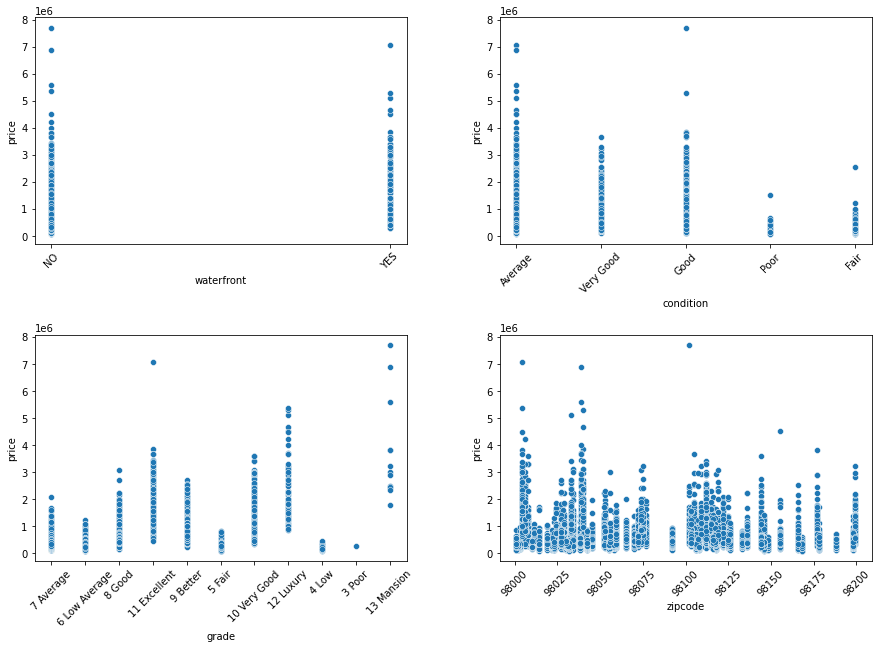
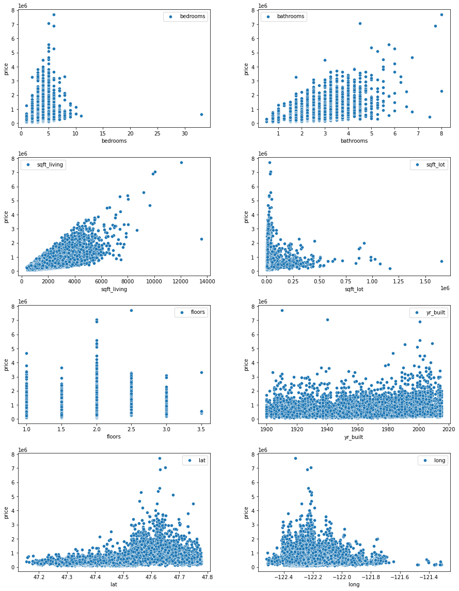
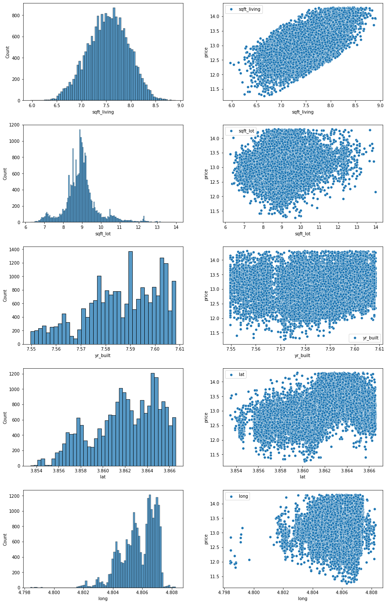

# Phase 2 Project Description

* Project Overview: the project goal, audience, and dataset
* Deliverables: the specific items you are required to produce for this project
* Grading: how your project will be scored
* Getting Started: guidance for how to begin working

## Project Overview

In this note, we are trying to help homeowners to buy or sell homes by predicting the price of the property in **King County, WA**. We will give them some suggestions how they could increase the value of the property and what are the main features that have th highest influence on the price of the property. To answer their questions, we use some available data from the housing prices in this county to present a model to predict the price of a house. 

In order to do so, we use regression methods to find an appropriate model to fit housing price data so that we can predict the price of different houses with different features. 

This notebook is organized as follows:

**2. Importing data.** In this part we import the data and we will introduce which columns it contains. 

**3. Functions.** This section contains the functions we defined to perform special computations for us. These functions are:

        3.1 corr
        3.2 summary_of_results
        3.3 concatenate

**4. Some Insight Into Data.** In this section we are trying to identify the categorical and numerical features. By plotting some graphs, we will find the outliers and how to clean the data. This section has the following subsections:

        4.1 Scatter Plots for Categorical Features
        4.2 Scatter Plots for Numerical data
        4.3 Cleaning data
        

**5. Categorical.** In this section, we are converting the categorical data into numerical values to be able to use them in the model. This section contains the following subsections:

        5.1 Dealing with Null Values
        5.2 Converting multi categorical columns to numerical values
        
**6. Preprocessing.** In this section, we are going to see the effects of containing different categorical and numerical variables on `R2` score to see which features we need to keep. This section contains:

        6.1 First Model: Putting `grade`, `condition` and `zipcode` into the model.
        6.2 Second Model: Putting only `condition` into the model.
        6.3 Third Model: Putting `grade` and `condition`  into the model.
        6.5 Forth Model-Part 1: Considering only `grade`  into the modeling.
        6.5 Forth Model-Part 2: Considering only `grade`  into the modeling.
        
**7. Features Selection.** In this section, based on the dataframe that we found in the previous section, we will try to find the features that we have more information but low collinearity and high `R2` score. We use different approaches to decide which features we need to keep. These approaches are used in different subsections which are: 

        7.1 First Approach By using p-values, R2 scores and Condition number.
        
**8. Final Model.** In this section, we find the baseline model to compare the model we found in the previous section with. This section contains the following subsections:

        8.1 Baseline Model
        8.2 Final Model
        8.3 Interpretation of Coefficients

**9. Prediction.** We will use the model introduced in the section 9 to predict some data. 

**10. Assumption Checking.** In this section, we are going to check the regression model's assumptions to see if they are satisfied or not. This section contains the following subsections:

        11.1 Normality of Residuals
        11.2 Investigating Multicollinearity (Independence Assumption)
        11.3 Investigating Homoscedasticity
        11.4 Investigating Linearity
        

**11. Summary and Suggestions.** In this section we discuss the model and we will we will give some suggestions as an answer to our business question.

### Business Problem

In this note, we are trying to help homeowners to buy or sell their properties in King County WA by predicting the price of their property by using Regression Models. We will give them some suggestions how they could increase the value of the property and what are the main features that have th highest influence on the price of the property. 

### The Data

This project uses the King County House Sales dataset, which can be found in  `kc_house_data.csv` in the data folder. The description of the column names can be found in `column_names.md` in the same folder.

#### Categorical Data

Categorical variables we use are:

* `waterfront`
* `condition`
* `grade`
* `zipcode`

The scatter plots of these features are:

#### Numerical Data

Numerical variables we use are:

* `price`
* `bedrooms`
* `bathrooms`
* `sqft_living`
* `sqft_lot`
* `floors`
* `yr_built`
* `lat`
* `long`
    
The scatter plots of these features before transformation are:
   

We transform the following features by using logarithmic function
* `price`
* `sqft_living`
* `sqft_lot`
* `yr_built`
* `lat`
* `long`

and we get the following scatter plot and histograms of these features:

