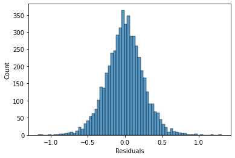
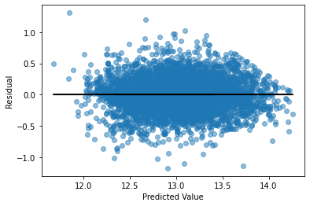
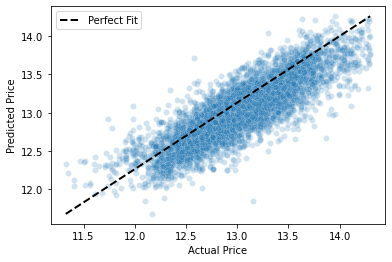

# Phase 2 Project Description

* Project Overview: the project goal, audience, and dataset
* Deliverables: the specific items you are required to produce for this project
* Grading: how your project will be scored
* Getting Started: guidance for how to begin working

## Project Overview

In this project, we will use the data on housing price in **King County in Washington** to analyze and to estimate the value of a property and we want to find out the features that have the highest influences on the price of a property and we want to find two ways to increase the value of a property. To do so, we use some available data from the housing prices in this county to present a model to predict the price of a house. We will use regression methods to find an appropriate model to fit housing price data so that we can predict the price of different houses with different features. 

This notebook is organized as follows:

**2. Importing data.** In this part we import the data and we will introduce which columns it contains. 

**3. Functions.** This section contains the functions we defined to perform special computations for us. These functions are:

        3.1 corr
        3.2 summary_of_results
        3.3 concatenate

**4. Some Insight Into Data.** In this section we are trying to identify the categorical and numerical features. By plotting some graphs, we will find the outliers and how to clean the data. This section has the following subsections:

        4.1 Scatter Plots for Categorical Features
        4.2 Scatter Plots for Numerical data
        4.3 Cleaning data
        

**5. Categorical.** In this section, we are converting the categorical data into numerical values to be able to use them in the model. This section contains the following subsections:

        5.1 Dealing with Null Values
        5.2 Converting multi categorical columns to numerical values
        
**6. Preprocessing.** In this section, we are going to see the effects of containing different categorical and numerical variables on `R2` score to see which features we need to keep. This section contains:

        6.1 First Model: Putting `grade`, `condition` and `zipcode` into the model.
        6.2 Second Model: Putting only `condition` into the model.
        6.3 Third Model: Putting `grade` and `condition`  into the model.
        6.5 Forth Model-Part 1: Considering only `grade`  into the modeling.
        6.5 Forth Model-Part 2: Considering only `grade`  into the modeling.
        
**7. Features Selection.** In this section, based on the dataframe that we found in the previous section, we will try to find the features that we have more information but low collinearity and high `R2` score. We use different approaches to decide which features we need to keep. These approaches are used in different subsections which are: 

        7.1 First Approach By using p-values, R2 scores and Condition number.
        
**8. Final Model.** In this section, we find the baseline model to compare the model we found in the previous section with. This section contains the following subsections:

        8.1 Baseline Model
        8.2 Final Model
        8.3 Interpretation of Coefficients

**9. Prediction.** We will use the model introduced in the section 9 to predict some data. 

**10. Assumption Checking.** In this section, we are going to check the regression model's assumptions to see if they are satisfied or not. This section contains the following subsections:

        11.1 Normality of Residuals
        11.2 Investigating Multicollinearity (Independence Assumption)
        11.3 Investigating Homoscedasticity
        11.4 Investigating Linearity
        

**11. Summary and Suggestions.** In this section we discuss the model and we will we will give some suggestions as an answer to our business question.

**12. Next Steps.** In this section we suggest how we may be able to improve the accuracy of our model.

### Business Problem

In this note, we are trying to help homeowners to buy or sell their properties in King County WA by predicting the price of their property by using Regression Models. We will give them some suggestions how they could increase the value of the property and what are the main features that have th highest influence on the price of the property. 

### The Data

This project uses the King County House Sales dataset, which can be found in  `kc_house_data.csv` in the data folder. The description of the column names can be found in `column_names.md` in the same folder.

#### Categorical Data

Categorical variables we use are:

* `waterfront`
* `condition`
* `grade`
* `zipcode`

#### Numerical Data

Numerical variables we use are:

* `price`
* `bedrooms`
* `bathrooms`
* `sqft_living`
* `sqft_lot`
* `floors`
* `yr_built`
* `lat`
* `long`
    

We transform the following features by using logarithmic function
* `price`
* `sqft_living`
* `sqft_lot`
* `yr_built`
* `lat`
* `long`

## Converting Categorical to numerical

We used `SciKit-learn` library to convert the categorical to numerical values.
For categorical variables with two values, we used `OrdinalEncoder` from `sklearn.preprocessing`
and for categorical variables with multiple values, we used `OneHotEncoder` 
from `sklearn.preprocessing`.

## Model.

We created different models and among them, we chose the features of 
our model based on the`R2` score for the model with those features and also we calculated 
`variance_inflation_factor` to make sure that we do not have collinearity.

We got the following values for `R2` score:

Train score(mean):       0.7187064792939413

Validation score(mean):  0.7215312885070686

## Assumption Checking.

### Normality of Residuals

### Multicollinearity (Independence Assumption)
We check the independence of features by calculating the variance_inflation_factor

### Homoscedasticity

### Linearity

## Summary and Suggestions:

Given that we cannot find a perfect model, each model has its own pros and cons. The model we proposed try to predict the price of a property in King County, WA by using `bedrooms`, `sqft_living`, `floors`, `yr_built`, `lat` as numerical features and `grade` of a house and its view toward a waterfall as the categorical value. This model has a mean of the cross validation score of `0.722`. 

We realized that `lat` has the highest coefficient with respect to other numerical features which means that this feature might have the highest impact on the price of a property. Since the latitude and longitude of a property represent the coordinate of the property on the earth, these columns contain the information about the location and zip code of the property. Therefore, it makes sense that `lat` should have a highest coefficient among others since it represents to location of a property. After `lat` , `sqft_living` has the second highest impact on the price of a property.

Among the categorical variables, we realize that improving the grade of a property to *Luxury* will increase the price of the property since this feature has the highest coefficient among other categorical variable. Therefore, we strongly suggest to improve the grade of a property because in turn the price of the house will increase greatly. 

Since one can not change the location of a property, it makes sense to increase the grade of the property. Therefore, we strongly suggest to improve the grade of a property because in turn the price of the house will increase greatly. 

In summary in order to increase the value of a property, we would suggest the following ways:

**1. Increase the square footage of living area by reducing the number of bedrooms.**

**2. Increase the grade of the property at lease to very good.**

## Next Steps

It is important to mention that we would get different results by considering different features in the model. Therefore, we would suggests next steps to improve the predictions

**1. Adding other features such as `sqft_basement` and `yr_renovated` to the model.**

**2. Adding some combination of features into the model.**

**3. Considering adding polynomial features to the model.**